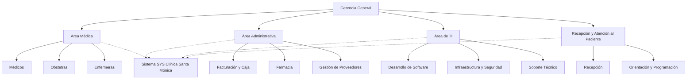

# 🏢 Estructura Organizativa – SYS Clínica Santa Mónica

El sistema **SYS Clínica Santa Mónica** es utilizado por diferentes áreas y perfiles de la clínica. Esta página describe la organización interna, los roles de los usuarios y cómo el sistema actúa como el **hilo conductor** que elimina la doble digitación y conecta todas las áreas.

---

## 🗂️ Áreas Funcionales y su Relación con el Sistema

| Área | Responsabilidad | Uso del Sistema | Beneficio Digital |
|------|-----------------|-----------------|-------------------|
| **Área Médica** | Consulta, diagnóstico, prescripción, seguimiento | Historia clínica electrónica, registro de evolución, acceso a antecedentes | Diagnóstico más rápido y preciso, continuidad asistencial |
| **Obstetricia** | Control prenatal, atención de parto, seguimiento posparto | Registro de controles, programación de seguimientos, alertas de inasistencia | Acompañamiento integral en todas las etapas reproductivas |
| **Recepción** | Registro de pacientes, programación de citas, orientación | Agenda digital, registro de datos, emisión de comprobantes | Reducción de tiempos de espera, primera impresión de orden y profesionalismo |
| **Administración** | Facturación electrónica, control de caja, gestión de proveedores, reportes | Módulo financiero, inventario de farmacia, generación de reportes | Trazabilidad total, cumplimiento SUNAT, toma de decisiones basada en datos |
| **Farmacia** | Dispensación de medicamentos, control de inventario | Módulo de farmacia vinculado a prescripciones | Reducción de errores, comodidad para la paciente, incremento de rentabilidad |
| **Tecnologías de Información (TI)** | Administración del sistema, seguridad, infraestructura | Monitoreo, respaldos, actualizaciones, integración con Evolution API | Disponibilidad 24/7, protección de datos clínicos, escalabilidad |

---

## 👥 Personajes de la Empresa (Roles y Perfiles)

Cada rol tiene un conjunto de permisos y vistas dentro del sistema, gestionado mediante autenticación JWT y políticas de autorización.

| Rol | Descripción | Funcionalidades Clave en el Sistema |
|-----|-------------|-------------------------------------|
| **Administrador General** | Dirección estratégica, supervisión global, cumplimiento normativo | Acceso a todos los módulos, reportes gerenciales, configuración de usuarios y permisos |
| **Médico Especialista** | Consulta clínica, diagnóstico, prescripción | Historia clínica electrónica, registro de evolución, acceso a estudios de imagen |
| **Obstetra** | Acompañamiento en planificación familiar, control prenatal, parto y posparto | Registro de controles, alertas de seguimiento, partograma digital |
| **Enfermera** | Preparación de consultorios, toma de signos vitales, educación a pacientes | Registro de signos vitales, apoyo en procedimientos |
| **Recepcionista** | Primer contacto, registro y programación de citas | Agenda digital, registro de pacientes, emisión de comprobantes |
| **Personal Administrativo** | Facturación, caja, inventario de farmacia, gestión de proveedores | Módulo financiero, reportes, gestión de inventarios |
| **Responsable de TI** | Desarrollo, mantenimiento y seguridad del sistema | Administración del VPS, base de datos, integraciones, monitoreo |
| **Pasante / Practicante** | Apoyo en digitalización y tareas operativas | Acceso limitado a módulos específicos bajo supervisión |

---

## 🧩 Organigrama de la Clínica Santa Mónica

El organigrama refleja la estructura jerárquica y la interdependencia de las áreas, todas ellas integradas a través del sistema digital.

### Nota: El sistema actúa como el eje integrador que conecta todas las áreas. La información generada en consulta médica (diagnóstico, receta) fluye automáticamente a la farmacia y a la facturación, eliminando la necesidad de reingresar datos.

### 🔄 Flujo de Información entre Áreas a través del Sistema
    - Registro y Cita (Recepción): La recepcionista registra a la paciente y agenda la cita en el sistema. La agenda se actualiza en tiempo real, evitando sobreposiciones.

    - Consulta (Área Médica): El médico u obstetra accede al historial completo de la paciente, registra la evolución y emite la receta. El sistema almacena automáticamente la prescripción.

    - Farmacia: Al terminar la consulta, la receta está disponible en el módulo de farmacia. La farmacéutica dispensa el medicamento y el sistema descuenta automáticamente del inventario.

    - Facturación: La atención y la dispensación se reflejan en el módulo financiero, generando el comprobante electrónico (SUNAT) sin necesidad de volver a digitar los datos.

    - Seguimiento: El sistema programa recordatorios automáticos por WhatsApp para la próxima cita o para seguimiento postparto, manteniendo el vínculo con la paciente.

    - Reportes: Todos los datos generados alimentan reportes gerenciales que permiten a la administración evaluar la ocupación de consultorios, la rentabilidad por servicio y la tasa de reconsulta.

### 📝 Notas sobre la Organización y el Sistema
    - El sistema no es una herramienta aislada**: Es el lenguaje común que hablan todas las áreas. Cada acción en un módulo impacta a los demás, eliminando los silos de información.

    - Capacitación: El personal recibe entrenamiento continuo para aprovechar al máximo las funcionalidades del sistema. La curva de aprendizaje se gestiona con acompañamiento personalizado, especialmente para el personal con menor familiaridad tecnológica.

    - Escalabilidad: La estructura organizativa está diseñada para crecer. La incorporación de nuevas especialidades (clínica general) se realizará replicando el modelo ya probado, sin necesidad de rediseñar la organización.